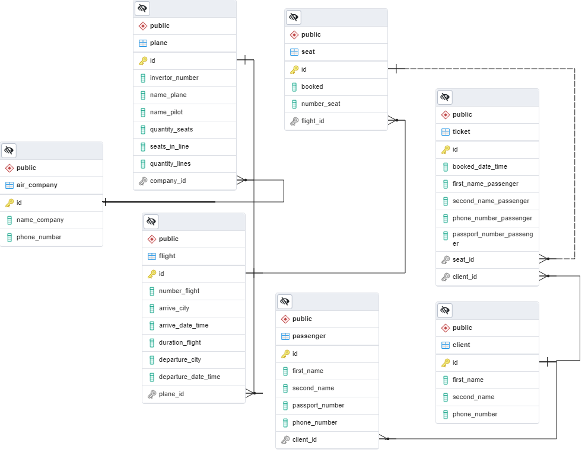

# APPLICATION FOR BOOK TICKETS OF FLIGHT

### DESCRIPTION
Application for choice flight from the timetable by requirements and book ticket. 
You can like 'ADMIN' blocked users, add new flights and new air-company.

### SCHEME DATA BASE MY APPLICATION:

### You need for start project:
        First, run:
        './mvnw clean install'
        Next:
        'docker-compose -f docker-compose.yml up -d --build'

Open link:  http://localhost:5002/web-app

You can also use the Swagger UI at link:  http://localhost:5001/data_base-app/swagger-ui
